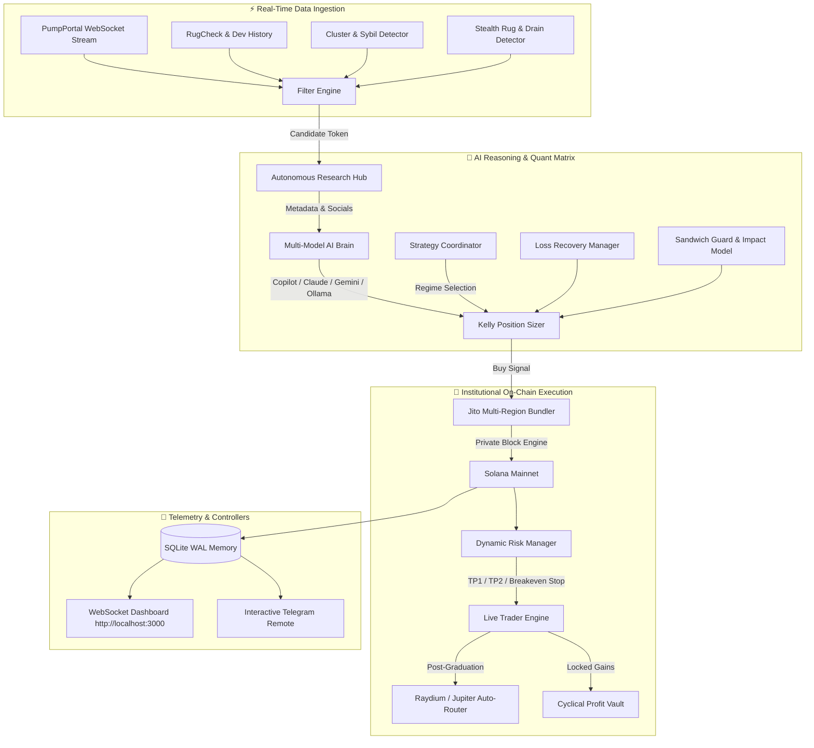

<div align="center">

# ⚡ PUMP.FUN QUANTUM PRO // TITAN v9.5 ⚡
### *Next-Gen Autonomous AI Trading Engine & Liquidity Matrix for Solana*

[](https://www.typescriptlang.org/)
[](https://solana.com/)
[](https://jito.wtf/)
[](https://openai.com/)
[](https://sqlite.org/)
[](LICENSE)

<br/>

```
  ██████╗ ██╗   ██╗███╗   ███╗██████╗     ███████╗██╗   ██╗███╗   ██╗
  ██╔══██╗██║   ██║████╗ ████║██╔══██╗    ██╔════╝██║   ██║████╗  ██║
  ██████╔╝██║   ██║██╔████╔██║██████╔╝    █████╗  ██║   ██║██╔██╗ ██║
  ██╔═══╝ ██║   ██║██║╚██╔╝██║██╔═══╝     ██╔══╝  ██║   ██║██║╚██╗██║
  ██║     ╚██████╔╝██║ ╚═╝ ██║██║         ██║     ╚██████╔╝██║ ╚████║
  ╚═╝      ╚═════╝ ╚═╝     ╚═╝╚═╝         ╚═╝      ╚═════╝ ╚═╝  ╚═══╝
               [ Q U A N T U M   A G E N T   v 9 . 5 ]
```

<p align="center">
  <b>High-Frequency Bonding Curve Execution</b> • <b>Chain-of-Thought AI Brain</b> • <b>Jito MEV Protection</b><br/>
  <b>Multi-Region Sub-Second Latency Racing</b> • <b>Cyclical Profit Vault</b> • <b>Raydium Auto-Router</b>
</p>

[Quick Start](#-quick-start) • [Architecture](#-system-architecture) • [Feature Matrix](#-core-features) • [Telegram Remote](#-telegram-remote-controller) • [Documentation](#-documentation-index)

---

</div>

## ⚠️ Important Disclaimer & Risk Notice

> [!WARNING]
> **Cryptocurrency trading on Solana & Pump.fun involves high financial risk.**
> - Memecoin trading is highly volatile and speculative. Past performance or AI confidence metrics do not guarantee future returns.
> - Always run in **Paper Trading Mode** (`npm run paper`) to validate your parameters before deploying real capital.
> - Never allocate funds you cannot afford to lose.

---

## 🌟 System Architecture



---

## ⚡ Core Features

| Module | Purpose & Capabilities | Status | File Link |
|:---|:---|:---:|:---|
| **MEV Sandwich Guard** | Pre-calculates bonding curve price impact and tightens slippage to neutralize MEV frontrunning bots | `ACTIVE` | [`sandwichGuard.ts`](file:///root/pumpfun/src/services/sandwichGuard.ts) |
| **Reinvestment Compounding** | Dynamically reinvests 5% of session profits into trade sizes with bankroll safety bounds | `ACTIVE` | [`reinvestmentEngine.ts`](file:///root/pumpfun/src/services/reinvestmentEngine.ts) |
| **Telegram Controller** | Long-polling phone remote with interactive `/status`, `/positions`, `/vault`, `/strategy`, and `/panic` commands | `ACTIVE` | [`telegramBot.ts`](file:///root/pumpfun/src/services/telegramBot.ts) |
| **Raydium / Jupiter Auto-Router** | Seamlessly detects bonding curve graduation (100%) and routes exits through Raydium CPMM / Jupiter AMM | `ACTIVE` | [`raydiumRouter.ts`](file:///root/pumpfun/src/services/raydiumRouter.ts) |
| **Social Virality Scraper** | Scrapes IPFS metadata, Twitter/X channels, and verifies authentic community links | `ACTIVE` | [`socialSentiment.ts`](file:///root/pumpfun/src/services/socialSentiment.ts) |
| **Loss Recovery Sizer** | Calculates controlled recovery multipliers on 90%+ confidence setups with defensive cooldown | `ACTIVE` | [`lossRecovery.ts`](file:///root/pumpfun/src/services/lossRecovery.ts) |
| **Stealth Drain Detector** | Identifies subtle developer ladder dumps masked by fake micro-buys in real-time | `ACTIVE` | [`stealthRugDetector.ts`](file:///root/pumpfun/src/services/stealthRugDetector.ts) |
| **Multi-RPC Latency Racing** | Benchmarks slot response times across endpoints and auto-fails over on latency spikes | `ACTIVE` | [`rpcFailover.ts`](file:///root/pumpfun/src/services/rpcFailover.ts) |
| **Sybil Cluster Detector** | Rejects multi-wallet developer bundle launches and artificial volume symmetry | `ACTIVE` | [`clusterDetector.ts`](file:///root/pumpfun/src/services/clusterDetector.ts) |
| **Cyclical Profit Vault** | Auto-locks $100 milestone profits into cold storage and resets seed bankroll to $1 | `ACTIVE` | [`profitVault.ts`](file:///root/pumpfun/src/services/profitVault.ts) |
| **Multi-Model AI Brain** | Quantitative Chain-of-Thought analysis via Copilot (`localhost:4141`), Claude, Gemini, or DeepSeek | `ACTIVE` | [`aiBrain.ts`](file:///root/pumpfun/src/services/aiBrain.ts) |
| **Jito Multi-Region MEV** | Parallel broadcast across Frankfurt, Amsterdam, NY, and Tokyo Jito block engines | `ACTIVE` | [`jitoBundler.ts`](file:///root/pumpfun/src/services/jitoBundler.ts) |
| **Web Dashboard & Audio** | Cyberpunk glassmorphism terminal with live charts, Web Audio API chimes, and AI Inspector | `ACTIVE` | [`index.html`](file:///root/pumpfun/src/public/index.html) |

---

## 🚀 Quick Start

### 1. Prerequisites
- **Node.js**: `v18.0.0` or higher
- **npm** or **yarn**
- **Solana Wallet**: Keypair JSON or Base58 Private Key

### 2. Installation
```bash
# Clone the repository
git clone https://github.com/yashab-cyber/pumpfun.git
cd pumpfun

# Install dependencies
npm install

# Build TypeScript binaries & frontend bundle
npm run build
```

### 3. Configuration (`.env`)
Create a `.env` file in the project root:
```ini
# Solana Network Configuration
RPC_URL=https://api.mainnet-beta.solana.com
SOLANA_PRIVATE_KEY=your_base58_private_key_here

# Trading Mode: 'paper' (Simulation) or 'live' (Real Mainnet SOL)
TRADING_MODE=paper
ACTIVE_STRATEGY=SNIPER

# Risk & Bankroll Management (SOL)
SOL_PER_TRADE=0.01
TAKE_PROFIT_1_PERCENT=50
TAKE_PROFIT_2_PERCENT=100
STOP_LOSS_PERCENT=-20
TRAILING_STOP_TRIGGER_PERCENT=30
SLIPPAGE_PERCENT=15
PRIORITY_FEE_SOL=0.001

# Profit Vault Milestones ($1 to $100 Cyclical Sweeper)
BASE_BANKROLL_SOL=0.01
PROFIT_VAULT_THRESHOLD_SOL=0.50
VAULT_DESTINATION_ADDRESS=your_cold_storage_solana_address

# AI Quantitative Brain Configuration
AI_PROVIDER=copilot
COPILOT_ENDPOINT=http://localhost:4141/v1/chat/completions

# Telegram Phone Controller & Notifications (Optional)
TELEGRAM_BOT_TOKEN=your_telegram_bot_token
TELEGRAM_CHAT_ID=your_telegram_chat_id
DISCORD_WEBHOOK_URL=your_discord_webhook_url
```

### 4. Launching the Agent

#### 🧪 Paper Trading Mode (Zero Capital Risk)
```bash
npm run paper
```

#### 💰 Live Mainnet Trading Mode (On-Chain SOL)
```bash
npm run live
```

Open **`http://localhost:3000`** in your browser to access the live terminal dashboard.

---

## 📱 Telegram Remote Controller

Manage and monitor your trading bot from your phone with interactive long-polling commands:

| Command | Action |
|:---|:---|
| `/status` | Returns live bankroll balance, win rate, realized PnL, and active AI model |
| `/positions` | Displays active open positions, entry prices, hold times, and live unrealized PnL |
| `/vault` | Shows total locked profit in SOL/USD and completed cycle milestones |
| `/strategy <NAME>` | Hot-swaps the active strategy (`SNIPER`, `MIGRATION_KOTH`, `MOMENTUM_SCALP`, `COPY_WHALE`) |
| `/sell <MINT>` | Liquidates a specific token position on-chain immediately |
| `/panic` | 🚨 **Emergency Stop**: Instantly liquidates all open positions into SOL |
| `/help` | Displays the interactive command menu |

---

## 📚 Documentation Index

Explore comprehensive deep-dive guides in the [`docs/`](file:///root/pumpfun/docs) directory:

- 🔑 [**Environment & Credentials Guide**](file:///root/pumpfun/docs/ENV_SETUP.md)
- 🥪 [**MEV Sandwich Guard & Price Impact**](file:///root/pumpfun/docs/SANDWICH_GUARD.md)
- 🪐 [**Raydium & Jupiter Auto-Router**](file:///root/pumpfun/docs/RAYDIUM_ROUTER.md)
- 🌐 [**Social Sentiment & Virality Scraper**](file:///root/pumpfun/docs/SOCIAL_VIRALITY.md)
- 🚨 [**Stealth Liquidity Drain Detector**](file:///root/pumpfun/docs/STEALTH_RUG_DETECTOR.md)
- ⚡ [**Multi-RPC Latency Racing & Failover**](file:///root/pumpfun/docs/RPC_FAILOVER.md)
- 🔍 [**Sybil Bundle & Cluster Detection**](file:///root/pumpfun/docs/CLUSTER_DETECTOR.md)
- 🏛️ [**Mathematical Formulas & Architecture**](file:///root/pumpfun/docs/ARCHITECTURE.md)
- 📊 [**Trading Strategies Specification**](file:///root/pumpfun/docs/STRATEGIES.md)
- 🧠 [**Multi-Model AI Brain Setup**](file:///root/pumpfun/docs/AI_MODELS.md)
- 🏦 [**Cyclical Profit Vault Mechanics**](file:///root/pumpfun/docs/PROFIT_VAULT.md)
- 🛡️ [**Jito MEV Private Bundle Protection**](file:///root/pumpfun/docs/JITO_MEV.md)
- 📱 [**Telegram Interactive Remote Setup**](file:///root/pumpfun/docs/TELEGRAM_SETUP.md)

---

## ⚖️ License

Distributed under the **MIT License**. See `LICENSE` for more information.

<div align="center">
  <sub>Built with ❤️ for the Solana & Pump.fun Trading Community</sub>
</div>
