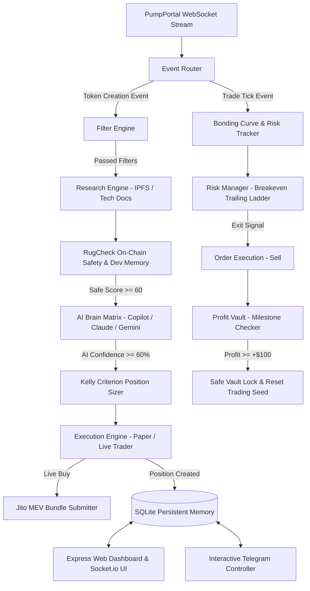

# 🏛️ System Architecture & Quantitative Specifications

## 1. High-Level Architecture Overview

The **Pump.fun Autonomous Trading Agent** is designed around a reactive, multi-tiered event pipeline. It ingests live Solana blockchain events via low-latency WebSockets, filters noise through multi-layered safety gates, subjects high-conviction opportunities to multi-model AI reasoning, and executes orders with MEV-protected atomic transactions.

---

## 2. AMM Bonding Curve Mathematics

Pump.fun uses a virtual constant-product Automated Market Maker (AMM) formula:

$$k = vSol \times vTokens$$

### Curve Constants
- **Initial Virtual SOL ($vSol_0$)**: $30 \text{ SOL} = 30 \times 10^9 \text{ lamports}$
- **Initial Virtual Tokens ($vTokens_0$)**: $1,073,000,000 \times 10^6 \text{ units}$
- **Total Real Token Supply ($S$)**: $1,000,000,000 \times 10^6 \text{ units}$ ($1 \text{ Billion tokens}$)
- **Graduation Threshold**: $\sim 85 \text{ SOL}$ of real SOL deposited ($\sim 115 \text{ virtual SOL}$)

### Tokens Received for Given SOL ($s$)
$$newVSol = vSol + s$$
$$newVTokens = \frac{k}{newVSol}$$
$$tokensOut = vTokens - newVTokens$$

### Execution Price & Price Impact
$$P_{initial} = \frac{vSol}{vTokens}$$
$$P_{execution} = \frac{s}{tokensOut}$$
$$\text{Price Impact } (\%) = \frac{P_{execution} - P_{initial}}{P_{initial}} \times 100$$

### Raydium Graduation Progress Percentage ($G$)
$$G = \min\left(100, \max\left(0, \frac{vSol - vSol_0}{85 \times 10^9} \times 100\right)\right)$$

---

## 3. Dynamic Kelly Criterion Position Sizing

Instead of static allocations, trade sizes scale with AI conviction and developer historical win rate:

$$S_{trade} = S_{base} \times M_{AI} \times M_{dev}$$

Where:
- $M_{AI}$:
  - $\ge 90\%$ confidence $\rightarrow 1.6\text{x}$
  - $80\% - 89\%$ confidence $\rightarrow 1.3\text{x}$
  - $70\% - 79\%$ confidence $\rightarrow 1.0\text{x}$
  - $< 70\%$ confidence $\rightarrow 0.7\text{x}$
- $M_{dev}$:
  - Dev Reputation $\ge 80/100 \rightarrow 1.2\text{x}$
  - Dev Reputation $\le 40/100 \rightarrow 0.6\text{x}$
- **Safety Boundary**: $S_{trade} \le 0.35 \times \text{Available Trading Seed}$

---

## 4. Multi-Tier Breakeven Stop Loss Ladder

To prevent winners from turning into losers, the Risk Manager elevates stop-loss levels as price advances:

| Milestone Stage | Trigger Condition | Action Taken | Remaining Position Risk |
|---|---|---|---|
| **Entry** | Buy Fill | Stop Loss set to Hard SL ($-20\%$) | Controlled Risk |
| **TP 1** | Price $\ge +50\%$ | Sells $50\%$ bag, elevates Stop Loss to **Breakeven ($+5\%$)** | **$100\%$ Risk-Free** |
| **TP 2** | Price $\ge +100\%$ | Sells $25\%$ bag, elevates Stop Loss to **$+30\%$ Profit Lock** | Guaranteed Profit |
| **TP 3** | Price $\ge +200\%$ | Sells remaining moonbag | Maximum Gain |
| **Trailing Stop** | Drop $\ge 15\%$ from Peak | Liquidates position immediately | Profit Captured |

---

## 5. SQLite Long-Term Memory Schema

The database (`data/memory.sqlite`) manages persistent state across application restarts:

- `trades`: Historical trade logs (id, mint, symbol, entry price, exit price, invested SOL, returned SOL, PnL, reasoning, timestamp).
- `active_positions`: Currently open positions (mint, entry price, current price, token amount, trailing peak, AI reasoning).
- `vault_cycles`: Completed profit vault milestones (cycle number, amount vaulted, cumulative vaulted, on-chain tx signature).
- `dev_memory`: Developer reputation tracking (created tokens, profitable tokens, rugged tokens, reputation score).
- `ai_decisions`: Comprehensive AI audit log (decision, confidence, reasoning, tags).
- `agent_state`: Key-value state storage for bankroll balances and strategy settings.
